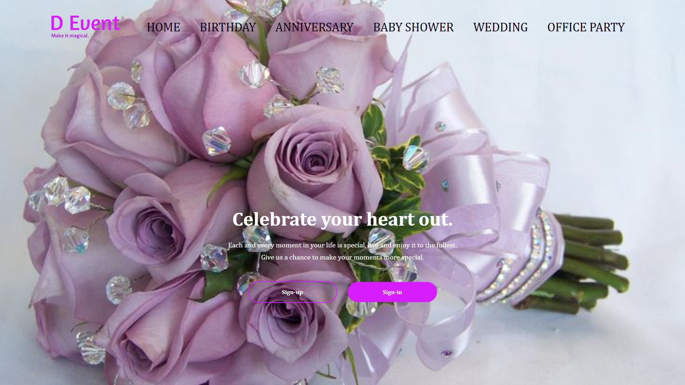

# 🌸 Flowers for Events – My First Website!

Welcome to my very first website project!  
Built during the early days of my web dev journey, this site may not be perfect — it’s not fully responsive, and you might spot a few rookie mistakes — but it holds a special place in my heart. 💖

---

## 🌼 About the Project

This was my beginner project focused on building a simple event/flower-themed website using basic HTML, CSS, and JS.  
It was never about perfection, but all about *starting*. From this, I learned a lot and have grown tremendously since then.

---

## 🌐 Preview

---

## 🔍 What You'll Find

- A flower-themed homepage 🎀  
- Static layout with basic sections  
- Custom fonts and styling  
- A glimpse of where it all started ✨

---

## 🚫 Limitations

- ❌ Not fully responsive (especially on mobile)
- ❌ Lacks modern best practices
- ✅ But hey — we all start somewhere!

---

## 🌱 What I Learned

- Structuring HTML pages
- Writing clean CSS (or trying to 😄)
- The joy of seeing something I built on a live link

---

## 📈 How Far I've Come

| Then | Now |
|------|-----|
| Basic HTML/CSS only | Full-stack apps with React, Node.js & MongoDB |
| No responsiveness | Mobile-first, responsive designs |
| Just starting | Contributed to real-world projects |
| Trial & error | Clean code and component-based architecture |

> From this simple flower site bloomed a full-stack dev 🌱

---

## 🔗 Live Website

👉 [Check it out on Netlify](https://flowersforevent-divyam.netlify.app/)

---

## 🗂 GitHub Repo

🔗 [Event-website Repository](https://github.com/Divyamsharma-18/Event-website)

---

## ❤️ Show Some Love

If you're someone starting out — don’t worry about perfection. Build, make mistakes, and grow.

**Made with love and a beginner’s excitement.**  
– *Divyam Sharma*
